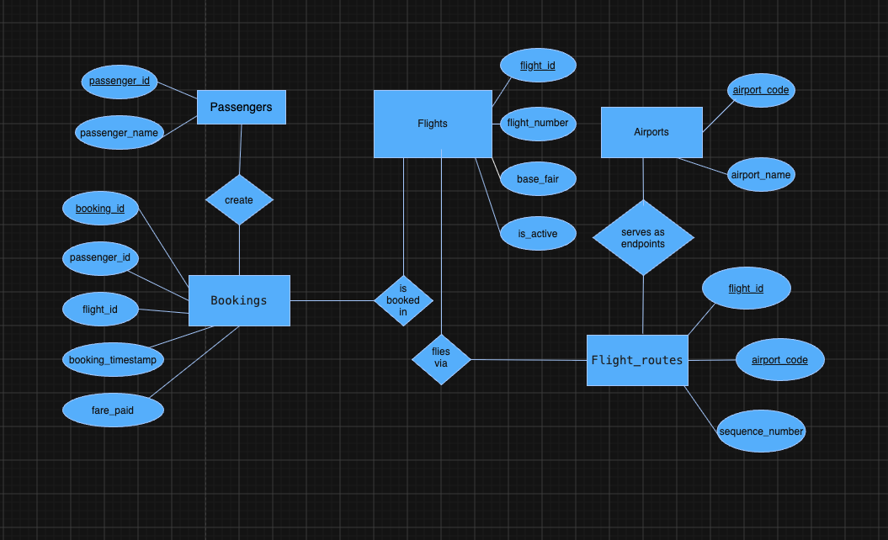

# Airline Booking Database

A relational schema modeling how passengers book flights, how flights connect airports, and how booking revenue can be tracked and aggregated.

**Theme:** Airline Booking

## Domain

This platform represents the core data behind an airline's booking system: passengers who search for and reserve seats, flights operated between airports, and the bookings that record each reservation along with the fare paid. It captures the fundamental many-to-one relationships of a marketplace — many passengers can book the same flight, and a single flight can serve multiple airports as it moves through its route — while keeping a high-volume, append-mostly log of every booking event as the system's central fact table.

The design needs to support day-to-day questions an airline's operations and finance teams would ask: Which flights are currently active and available for booking? What is the total or average fare collected per flight, per passenger, or over a given time period? Which airports does a given flight depart from, arrive at, or stop at along the way? How many bookings has a specific passenger made, and what is their total spend? Which routes generate the most revenue, and how does that trend over time?

Beyond individual lookups, the schema is built to answer aggregate and relational questions that span multiple tables — for example, identifying the busiest airports by counting how many flights route through them, ranking flights by revenue using the `fare_paid` metric in `Bookings`, or filtering flights by their base fare and active status to power search and pricing features. The separation of `Flights` (the supply-side entity) from `Flight_routes` (the many-to-many link to `Airports`) also allows the system to model multi-stop or connecting flights without duplicating flight-level data, keeping the schema normalized while remaining flexible enough to grow with additional route complexity.

